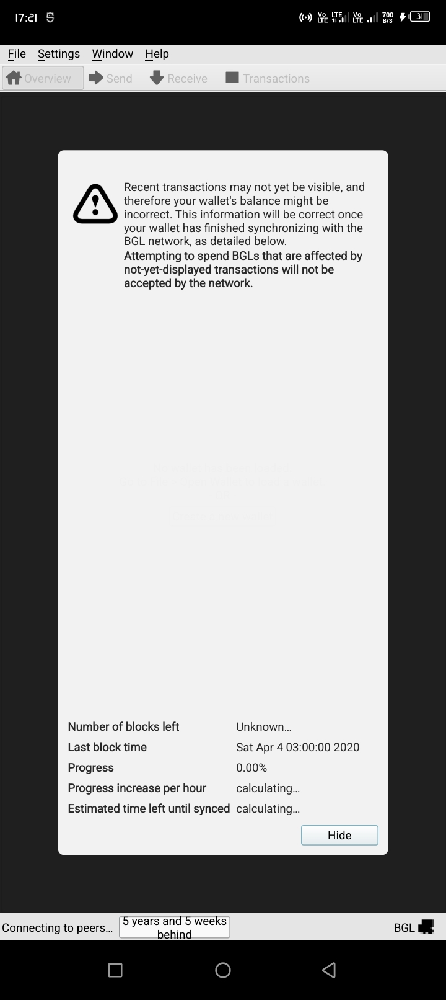
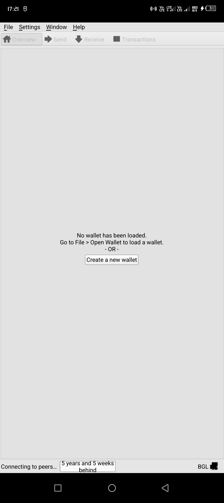
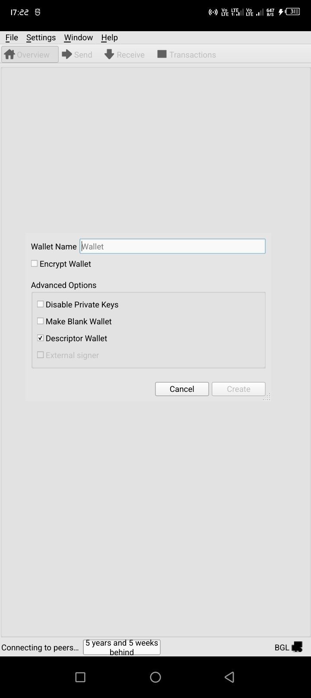
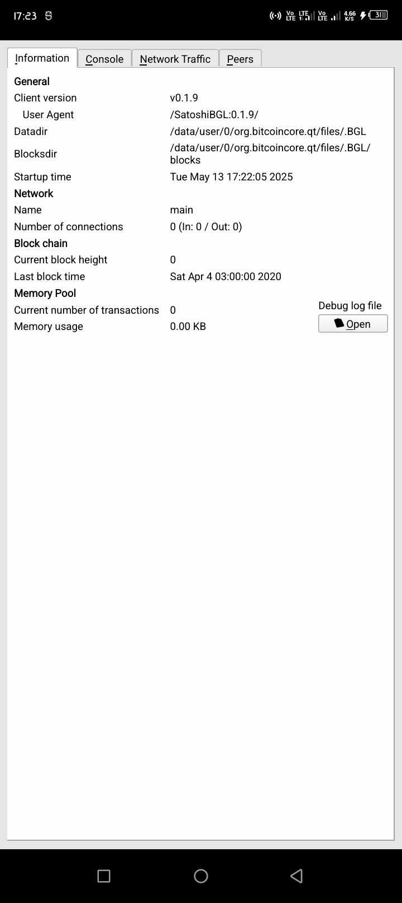

# android-bitgesell-docker


Docker setup for cross-compiling Bitgesell core for Android (SDK 28+) from a Docker container

## Notes
- Uses `NDK` version = `23` see (`Dockerfile` for more details)
- Works with `libc++` version and `Qt 5.15.2` (tested on this release `0.1.9`)


## 1. Build environment setup for Android
1. Setup environment(needs Docker)

Build the docker image from `Dockerfile`:

```sh
git clone https://https://github.com/naftalimurgor/android-bitgesell-docker
cd android-bitgesell-docker/
docker build -t android-bitgesell .
```

## 2. Build Bitgesell APK 

Clone the Bitgesell repo with the Android Patch(see respective branch):

```sh
git clone https://github.com/naftalimurgor/bitgesell.git
cd bitgesell
# patched for Android based on this patched release:
git checkout android-patch-0.1.9

# run the container
docker run --rm -v $(pwd):/work --user root -it android-bitgesell /bin/bash
cd /work
```

while inside the container in `bash` interractive mode,

1. Cross compile libs:
```sh
/work
make -C depends/ HOST=aarch64-linux-android
```
Note: ensure you provide platform triplet i.e `aarch64-linux-android`  for 64-bit ARM architecture for Linux.

which outputs on success:

```sh
....
/bin/mkdir -p '/work/depends/work/staging/aarch64-linux-android/zeromq/4.3.1-559e011f607/work/depends/aarch64-linux-android/include'
/usr/bin/install -c -m 644 include/zmq.h include/zmq_utils.h '/work/depends/work/staging/aarch64-linux-android/zeromq/4.3.1-559e011f607/work/depends/aarch64-linux-android/include'
/bin/mkdir -p '/work/depends/work/staging/aarch64-linux-android/zeromq/4.3.1-559e011f607/work/depends/aarch64-linux-android/lib/pkgconfig'
/usr/bin/install -c -m 644 src/libzmq.pc '/work/depends/work/staging/aarch64-linux-android/zeromq/4.3.1-559e011f607/work/depends/aarch64-linux-android/lib/pkgconfig'
make[1]: Leaving directory '/work/depends/work/build/aarch64-linux-android/zeromq/4.3.1-559e011f607'
Postprocessing zeromq...
Caching zeromq...
copying packages: boost libevent zlib qt qrencode bdb miniupnpc zeromq
to: /work/depends/aarch64-linux-android
make: Leaving directory '/work/depends'
```
The cross-compiled libs for Android are :
```sh
-  boost libevent zlib qt qrencode bdb miniupnpc zeromq
```

Note: `make -C depends/ HOST=aarch64-linux-android` needs faster internet connection as `curl` times out forcing redownload from `https://BGLcore.org/depends` which doesn't have any of the packages.

Note: To clean up:

```sh
make -C depends/ clean #cleans up the dependencies
```

2. Run `./autogen.sh` to generate all the necessary config files:

```sh
./autogen.sh
```

3. Set `clang` C++ compiler for current session:

```sh
export API=28
export TOOLCHAIN=/opt/android-sdk-linux/ndk/23.1.7779620/toolchains/llvm/prebuilt/linux-x86_64/bin

export CC=$TOOLCHAIN/aarch64-linux-android${API}-clang
export CXX=$TOOLCHAIN/aarch64-linux-android${API}-clang++
export AR=$TOOLCHAIN/llvm-ar
export RANLIB=$TOOLCHAIN/llvm-ranlib
export STRIP=$TOOLCHAIN/llvm-strip

```

Symlink `QtCore` lib for `configure` to find it easily:

```sh
cd depends/$HOST/lib/pkgconfig
for f in *Qt5*_arm64-v8a.pc; do
    ln -s "$f" "${f/_arm64-v8a/}"
done
cd /work
```

Also, expose `pkgconfig` path also for `./configure` to locate `PKG_CONFIG_PATH`:

```sh
export PKG_CONFIG_PATH=$(pwd)/depends/$HOST/lib/pkgconfig
```
Symlink qt files (with `_arm64-v8a*.a`) so the linker finds them:

Check if files exist:
```sh
# check for unsuffixed files
ls -l /work/depends/aarch64-linux-android/lib/libqtfreetype.a
ls -l /work/depends/aarch64-linux-android/plugins/platforms/libplugins_platforms_qtforandroid.a

```
If these files exist, they are symlinks to the _arm64-v8a versions, and the linker should find them.
If they don’t exist, create symlinks to match the expected names:

## Symlink the libs (`libqtfreetype_arm64-v8a` and `libplugins_platforms_qtforandroid_arm64-v8a`)

```sh
ln -s /work/depends/aarch64-linux-android/lib/libqtfreetype_arm64-v8a.a \
      /work/depends/aarch64-linux-android/lib/libqtfreetype.a
ln -s /work/depends/aarch64-linux-android/plugins/platforms/libplugins_platforms_qtforandroid_arm64-v8a.a \
      /work/depends/aarch64-linux-android/plugins/platforms/libplugins_platforms_qtforandroid.a
```

Verify symlinked files:

````sh
ls -l /work/depends/aarch64-linux-android/lib/libqtfreetype*
ls -l /work/depends/aarch64-linux-android/plugins/platforms/libplugins_platforms_qtforandroid*
````

4. `./configure` to generate Make file:

```sh
./configure --prefix=/work/depends/aarch64-linux-android             --host=aarch64-linux-android             --with-gui=qt5             LDFLAGS="-L/work/depends/aarch64-linux-android/lib -L/work/depends/aarch64-linux-android/plugins/platforms" --disable-tests
```

Upon success should output:
```sh

Build Options:
  with external callbacks = no
  with benchmarks         = no
  with tests              = no
  with coverage           = no
  with examples           = no
  module ecdh             = no
  module recovery         = yes
  module extrakeys        = yes
  module schnorrsig       = yes

  asm                     = no
  ecmult window size      = 15
  ecmult gen prec. bits   = 4

  valgrind                = no
  CC                      = /opt/android-sdk-linux/ndk/23.1.7779620/toolchains/llvm/prebuilt/linux-x86_64/bin/aarch64-linux-android28-clang
  CPPFLAGS                =  -I/work/depends/aarch64-linux-android/include/ 
  SECP_CFLAGS             = -O2  -std=c89 -pedantic -Wno-long-long -Wnested-externs -Wshadow -Wstrict-prototypes -Wundef -Wno-overlength-strings -Wall -Wno-unused-function -Wextra -Wcast-align -Wconditional-uninitialized -fvisibility=hidden 
  CFLAGS                  = -std=c11 
  LDFLAGS                 = -L/work/depends/aarch64-linux-android/lib -lc++

Options used to compile and link:
  external signer = yes
  multiprocess    = no
  with experimental syscall sandbox support = no
  with libs       = yes
  with wallet     = yes
    with sqlite   = yes
    with bdb      = yes
  with gui / qt   = yes
    with qr       = yes
  with zmq        = yes
  with test       = no
  with fuzz binary = yes
  with bench      = no
  with upnp       = yes
  with natpmp     = yes
  use asm         = yes
  USDT tracing    = no
  sanitizers      = 
  debug enabled   = no
  gprof enabled   = no
  werror          = no
  LTO             = no

  target os       = linux-android
  build os        = linux-gnu

  CC              = /opt/android-sdk-linux/ndk/23.1.7779620/toolchains/llvm/prebuilt/linux-x86_64/bin/aarch64-linux-android28-clang
  CFLAGS          = -pthread -std=c11 
  CPPFLAGS        =   -U_FORTIFY_SOURCE -D_FORTIFY_SOURCE=2  -DHAVE_BUILD_INFO -DPROVIDE_FUZZ_MAIN_FUNCTION -I/work/depends/aarch64-linux-android/include/ 
  CXX             = /opt/android-sdk-linux/ndk/23.1.7779620/toolchains/llvm/prebuilt/linux-x86_64/bin/aarch64-linux-android28-clang++ -std=c++17
  CXXFLAGS        =    -Wstack-protector -fstack-protector-all      -std=c++17 --std=c++17
  LDFLAGS         =    -Wl,-z,relro -Wl,-z,now -Wl,-z,separate-code -pie   -L/work/depends/aarch64-linux-android/lib -lc++
  ARFLAGS         = cr

```

5. `make -j $(nproc)`
Run make

```sh
make HOST=aarch64-linux-android -j $(nproc)
```

Should output:

```sh
root@fc88f2344529:/work# make -j8
Making all in src
make[1]: Entering directory '/work/src'
make[2]: Entering directory '/work/src'
make[3]: Entering directory '/work'
make[3]: Leaving directory '/work'
  CXX      qt/qt_BGL_qt-main.o
  CXX      qt/qt_libBGLqt_a-bantablemodel.o
  CXX      qt/qt_libBGLqt_a-BGL.o
  CXX      qt/qt_libBGLqt_a-BGLaddressvalidator.o
  CXX      qt/qt_libBGLqt_a-BGLamountfield.o
  CXX      qt/qt_libBGLqt_a-BGLunits.o
  CXX      qt/qt_libBGLqt_a-BGLgui.o
  CXX      qt/qt_libBGLqt_a-clientmodel.o
  CXX      qt/qt_libBGLqt_a-csvmodelwriter.o
  CXX      qt/qt_libBGLqt_a-guiutil.o
  CXX      qt/qt_libBGLqt_a-intro.o
  CXX      qt/qt_libBGLqt_a-modaloverlay.o
  CXX      qt/qt_libBGLqt_a-networkstyle.o
  CXX      qt/qt_libBGLqt_a-notificator.o
  CXX      qt/qt_libBGLqt_a-optionsdialog.o
  CXX      qt/qt_libBGLqt_a-optionsmodel.o
  CXX      qt/qt_libBGLqt_a-peertablemodel.o
  CXX      qt/qt_libBGLqt_a-platformstyle.o
  CXX      qt/qt_libBGLqt_a-qvalidatedlineedit.o
  CXX      qt/qt_libBGLqt_a-qvaluecombobox.o
  CXX      qt/qt_libBGLqt_a-rpcconsole.o
  CXX      qt/qt_libBGLqt_a-splashscreen.o
  CXX      qt/qt_libBGLqt_a-trafficgraphwidget.o
  CXX      qt/qt_libBGLqt_a-utilitydialog.o
  CXX      qt/qt_libBGLqt_a-moc_addressbookpage.o
...
```

6. Build the BGL-qt GUI apk 

```sh
make -C src/qt apk
```
The above process outputs the following: 
```sh
Download https://jcenter.bintray.com/org/apache/httpcomponents/httpmime/4.1/httpmime-4.1.jar
Download https://jcenter.bintray.com/org/jetbrains/annotations/13.0/annotations-13.0.jar
Download https://jcenter.bintray.com/org/apache/httpcomponents/httpclient/4.2.6/httpclient-4.2.6.jar
Download https://jcenter.bintray.com/com/sun/activation/javax.activation/1.2.0/javax.activation-1.2.0.jar
Download https://jcenter.bintray.com/org/apache/httpcomponents/httpcore/4.2.5/httpcore-4.2.5.jar
Download https://jcenter.bintray.com/net/sf/kxml/kxml2/2.3.0/kxml2-2.3.0.jar
Download https://jcenter.bintray.com/commons-logging/commons-logging/1.1.1/commons-logging-1.1.1.jar
Download https://jcenter.bintray.com/org/glassfish/jaxb/jaxb-core/2.2.11/jaxb-core-2.2.11.jar
Download https://jcenter.bintray.com/org/glassfish/jaxb/jaxb-runtime/2.2.11/jaxb-runtime-2.2.11.jar
Download https://jcenter.bintray.com/org/jvnet/staxex/stax-ex/1.7.7/stax-ex-1.7.7.jar
Download https://jcenter.bintray.com/com/sun/xml/fastinfoset/FastInfoset/1.2.13/FastInfoset-1.2.13.jar
Download https://jcenter.bintray.com/javax/xml/bind/jaxb-api/2.2.12-b140109.1041/jaxb-api-2.2.12-b140109.1041.jar
Download https://jcenter.bintray.com/commons-codec/commons-codec/1.6/commons-codec-1.6.jar
Download https://jcenter.bintray.com/org/glassfish/jaxb/txw2/2.2.11/txw2-2.2.11.jar
Download https://jcenter.bintray.com/com/sun/istack/istack-commons-runtime/2.21/istack-commons-runtime-2.21.jar
Download https://dl.google.com/dl/android/maven2/com/android/tools/sdk-common/26.1.0/sdk-common-26.1.0.jar

BUILD SUCCESSFUL in 4m 19s
1 actionable task: 1 executed
cd qt/android && ./gradlew build
Downloading https://services.gradle.org/distributions/gradle-6.6.1-bin.zip
...
```
apks will be output to:

```sh
src/qt/android/build/outputs/apk/release/android-release-unsigned.apk
src/qt/android/build/outputs/apk/debug/android-debug.apk
```

Check build for sample apk files under `build/`

And here it is!







## Roadmap

This is experimental, currently the project is in progress as follows:
- [x] `make -C depends/ HOST=aarch64-linux-android`
- [x] `./autogen.sh`
- [x] `./configure --host=$HOST --prefix=$PWD/depends/$HOST --with-gui=qt5 --enable-glibc-back-compat --disable-bench --disable-tests`
- [x] `make -j $(nproc)`
- [x] `make -C src/qt apk` - builds the apk - should bundle `libbitgesell.so` and also as part of main JNI lib


Target is to cross-compile with `Qt 6x` in sync with the current Bitcoin core updates. See issue submitted here: https://github.com/bitcoin/bitcoin/issues/32254